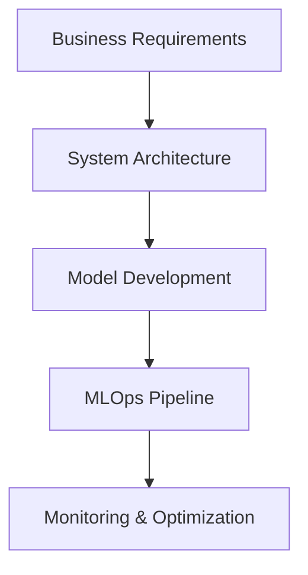
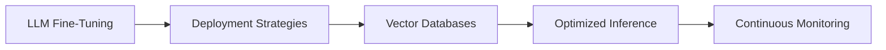

<!--
**abhi1497/abhi1497** is a ✨ _special_ ✨ repository because its `README.md` (this file) appears on your GitHub profile.

Here are some ideas to get you started:

- 🔭 I’m currently working on ...
- 🌱 I’m currently learning ...
- 👯 I’m looking to collaborate on ...
- 🤔 I’m looking for help with ...
- 💬 Ask me about ...
- 📫 How to reach me: ...
- 😄 Pronouns: ...
- ⚡ Fun fact: ...
-->
# Hi there 👋 I'm Abhishek Chavda
**Senior AI/ML Engineer & Technical Lead** | Building Intelligent Systems at Scale  
[](https://www.linkedin.com/in/abhi-chavda)
[](mailto:abhichavda97@gmail.com)
<!--[](your-portfolio-url)-->

```python
class AIEngineer:
    def __init__(self):
        self.expertise = "Machine Learning | System Design | LLM Architecture"
        self.industries = ["Healthcare", "Finance", "Manufacturing", "Automotive"]
        self.tech_stack = {
            "ML Frameworks": ["TensorFlow", "PyTorch", "HuggingFace"],
            "Cloud": ["AWS", "Azure"],
            "MLOps": ["Kubernetes", "TFX", "Kubeflow"],
            "AI Agents": ["CrewAI", "LangChain"],
            "Databases": ["PostgreSQL", "Neo4j", "Chroma"]
        }
```
<!--
## 🏆 Featured Projects
[Project Name] - LLM Orchestration Framework
Tech: CrewAI • LangChain • VectorDBs • FastAPI
▶️ Enterprise-grade framework for building autonomous AI agent networks
✅ Production deployment serving 1M+ daily inferences
⭐ 850+ GitHub stars | 🍴 230+ forks

[Project Name] - Medical Imaging Pipeline
Tech: PyTorch • MONAI • DICOM • TensorRT
🩺 3D segmentation model achieving 98.5% Dice score
⚡ Optimized inference latency <50ms on edge devices

[Open-Source Library] - NLP Toolkit
Tech: Transformers • spaCy • ONNX
📦 15k+ monthly downloads on PyPI
🤝 120+ community contributors
-->
## 🔨 Technical Leadership

- Led teams delivering 12+ production ML systems
- Reduced model deployment cycles by 40% through CI/CD automation
- Architected solutions handling 50+ GB datasets

## 🔧 Core Expertise
AI/ML Architecture



## 🛠️ Tech Stack
**AI Development**  


**Productionization**  


**Data Engineering**  


## 📈 GitHub Activity

[](https://github.com/abhi1497)
[](https://github.com/abhi1497)

## 📫 Let's Collaborate!
- 🔭 Currently exploring: **DeepLearning, Quantum Machine Learning**
- 💬 Ask me about: **Career growth in AI** | **ML system design** | **AI architecture patterns**
- 📫 Reach me: abhichavda97@gmail.com or [LinkedIn](https://www.linkedin.com/in/abhi-chavda)


> "Real work from real humans will always prevail!" - Abhishek Chavda
