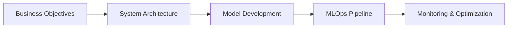

<!--
**abhi1497/abhi1497** is a ✨ _special_ ✨ repository because its `README.md` (this file) appears on your GitHub profile.

Here are some ideas to get you started:

- 🔭 I’m currently working on ...
- 🌱 I’m currently learning ...
- 👯 I’m looking to collaborate on ...
- 🤔 I’m looking for help with ...
- 💬 Ask me about ...
- 📫 How to reach me: ...
- 😄 Pronouns: ...
- ⚡ Fun fact: ...
-->
# 👋 Hi there! I'm Abhishek Chavda
**Senior AI/ML Engineer & Technical Lead** | Building Enterprise-Grade Intelligent Systems  
[](https://www.linkedin.com/in/abhi-chavda)
[](mailto:abhichavda97@gmail.com)
[](your-portfolio-url)

```python
class AIEngineer:
    def __init__(self):
        self.expertise = "Data Science | Machine Learning | Deep Learning | MLOps"
        self.domains = ["Healthcare", "Finance", "Edge AI"]
        self.stack = {
            "ML Frameworks": ["PyTorch", "TensorFlow", "HuggingFace"],
            "Cloud": ["AWS (SageMaker, Bedrock)", "Azure ML"],
            "MLOps": ["Kubeflow", "TFX", "MLflow"],
            "AI Orchestration": ["LangChain", "CrewAI", "AutoGen"],
            "Infra": ["Kubernetes", "Docker", "Terraform"]
        }
```

## 🔧 Technical Leadership



- Led delivery of **12+ production ML systems** across healthcare and finance
- Reduced deployment cycles by **40%** through CI/CD automation
- Architected solutions processing **50GB+ datasets** daily
- Mentored 8 junior engineers in ML best practices

## 🛠️ Core Technologies

**AI Development**  


**MLOps & Cloud**  


**Data Systems**  


## 📊 GitHub Activity

[](https://github.com/abhi1497)
[](https://github.com/abhi1497)

## 💬 Let's Connect

- 🔭 **Exploring:** Quantum ML • Neuromorphic Computing • Federated Learning
- 💬 **Ask me about:** ML system design patterns • Career growth in AI • Productionizing LLMs
- 📫 **Reach out:** [Email](mailto:abhichavda97@gmail.com) | [LinkedIn](https://www.linkedin.com/in/abhi-chavda)
- 🌱 **Learning:** Rust • Distributed Training Optimization

> "Human ingenuity will always be the ultimate intelligence amplifier" - AC
